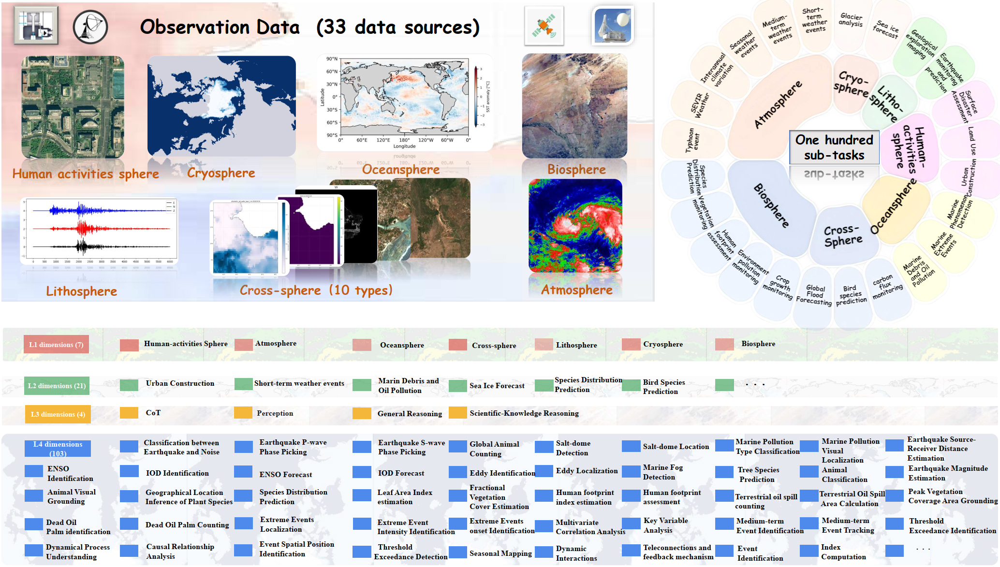
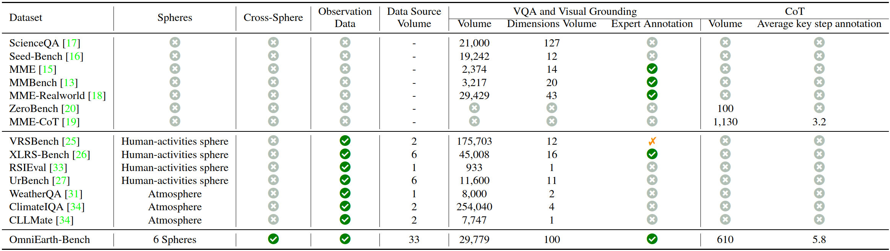
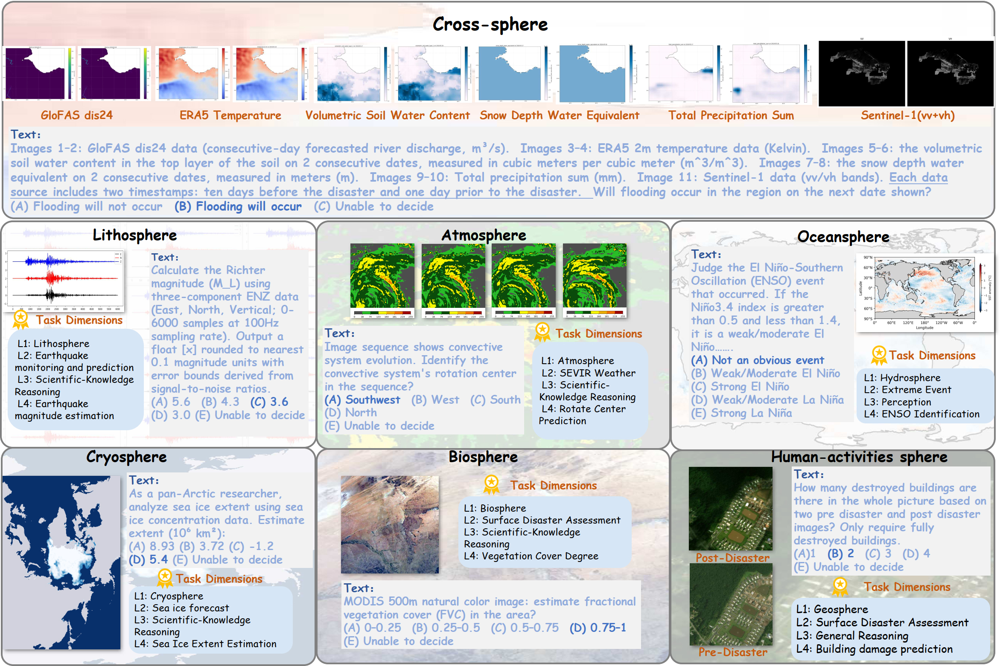
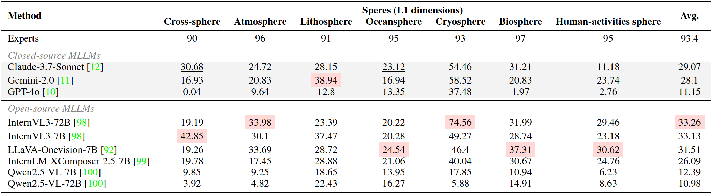
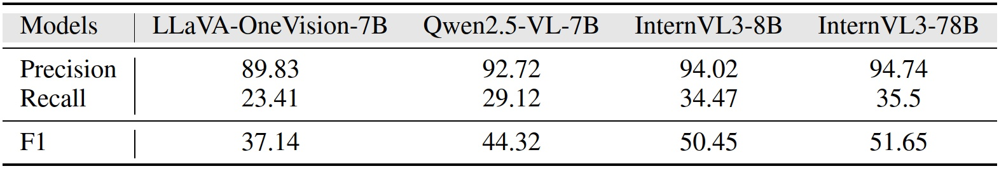

<div align="center">
  <h2><strong>OmniEarth-Bench: Towards Holistic Evaluation of Earth's Six Spheres and Cross-Spheres Interactions with Multimodal Observational Earth Data</strong></h2>
  <h5>
  Fengxiang Wang<sup>1,2</sup>, Mingshuo Chen<sup>3</sup>, Xuming He<sup>2,4</sup>,  Yi-Fan Zhang<sup>9</sup>
      <br/>
  Feng Liu<sup>2,5</sup>, Zijie Guo<sup>6</sup>, Zhenghao Hu<sup>7</sup>, Jiong Wang<sup>2,6</sup>, Jingyi Xu<sup>2,6</sup>
      <br/>
  Zhangrui Li<sup>2,8</sup>, Fenghua Ling<sup>2</sup>, Ben Fei<sup>2</sup>, Weijia Li<sup>7</sup>
  Long Lan<sup>1</sup>, Wenjing Yang<sup>1&nbsp;†</sup>, Wenlong Zhang<sup>2&nbsp;†</sup>, Lei Bai<sup>2</sup>
      <br/><br/>
    <sup>1</sup> National University of Defense Technology, China, <sup>2</sup> Shanghai Artificial Intelligence Laboratory, China
      <br/>
    <sup>3</sup> Beijing University of Posts and Telecommunications, China, <sup>4</sup> Zhejiang University, China
      <br/>
    <sup>5</sup> Shanghai Jiao Tong University, China, <sup>6</sup> Fudan University, China, <sup>7</sup> Sun Yat-sen University, China
      <br/>
    <sup>8</sup> Nanjing University, China, <sup>9</sup> Chinese Academy of Sciences
  </h5>
  <p>
    [📃 <a href="https://arxiv.org/abs/2505.23522" target="_blank">Paper</a>]
    [🌐 <a href="https://omniearth-bench.github.io" target="_blank">Website</a>]
    [🤗 <a href="https://huggingface.co/datasets/initiacms/OmniEarth-Bench" target="_blank">OmniEarth-Bench</a>]
    [🏆 <a href="https://omniearth-bench.github.io/#benchmark" target="_blank">Leaderboard</a>]
  </p>
</div>


## 🔥News

* **[2025-05-30]** Revised Dataset **v2** in progress (coming soon)
* **[2025-05-29]** Paper available on arXiv.
* **[2025-05-15]** Dataset released on Hugging Face.

## 📚 Contents

- [🔥News](#news)
- [📚Contents](#-contents)
- [🔍Dataset Overview](#dataset-overview)
- [📸Dataset](#dataset)
- [🚀Evaluation](#evaluation)
- [🔗Citation](#citation)
- [📬Contact](#contact)

## 🔍Dataset Overview



<p align="center"><strong>Fig 1. Overview of OmniEarth-Bench.</strong></p>

​	We introduce **OmniEarth-Bench**, the first comprehensive multimodal benchmark spanning all six Earth science spheres (**atmosphere, lithosphere, Oceansphere, cryosphere, biosphere and Human-activities sphere**) and **cross-spheres** with one hundred expert-curated evaluation dimensions. Leveraging observational data from satellite sensors and in-situ measurements, OmniEarth-Bench integrates 29,779 annotations across four tiers: **perception, general reasoning, Scientific‑knowledge reasoning and chain-of-thought (CoT) reasoning**. The key contributions are:

* **Comprehensive Evaluation Across All Six Spheres**. OmniEarth-Bench is the first benchmark to extensively cover all Earth science spheres, offering 58 practical and comprehensive evaluation dimensions that significantly surpass prior benchmarks.
* **Pioneering Cross-Sphere Evaluation Dimensions**. To address complex real-world scenarios, OmniEarth-Bench introduces cross-sphere evaluation capabilities for societally important tasks such as disaster prediction and ecological forecasting.
* **CoT-Based Reasoning Evaluations in Earth Science**. OmniEarth-Bench establishes, for the first time, CoT-based evaluations tailored for complex Earth science reasoning tasks, addressing scenarios where previous benchmarks showed near-zero accuracy, and explores how CoT strategies might enhance reasoning capabilities in the Earth domain.

## 📸Dataset

### Comparision and Examples



<p align="center"><strong>Fig 2. Comparision with existing benchmarks.</strong></p>

​	OmniEarth-Bench defines tasks across four hierarchical levels (L1–L4), comprising 7 L1 dimensions, 23 L2 dimensions, 4 L3 dimensions, and 103 expert-defined L4 subtasks with real-world applicability. One representative L4 subtask from each L1 sphere is illustrated in Fig 3. Detailed descriptions of the L3 and L4 dimensions are provided in the paper's appendix.



<p align="center"><strong>Fig 3. Examples of OmniEarth-Bench.</strong></p>

### Benchmark Results

For specific results on each L2, L3 and L4 dimensions, please check the paper's appendix.



<p align="center"><strong>Fig 4. Experimental results on each sphere of VQA tasks, with models ranked by average performance.} Avg. represents the average accuracy across sub-tasks. Proprietary models are highlighted in gray. "Experts" means evaluation results of 100 examples in each sphere by experts. We mark the highest score of each metric in red, and second highest underlined.</strong></p>

Following [MME-CoT](https://github.com/MME-Benchmarks/MME-CoT), we report the precision, recall and f1 on CoT tasks:



<p align="center"><strong>Fig 5. CoT Performance on OmniEarth-Bench.</strong></p>

## 🚀Evaluation

Please refer to [evaluation/README.md](https://github.com/nanocm/OmniEarth-Bench/tree/main/evaluation#evaluation)

## 🔗Citation

If you find our work helpful, please consider citing:

```latex
@article{wang2025omniearthbenchholisticevaluationearths,
      title={OmniEarth-Bench: Towards Holistic Evaluation of Earth's Six Spheres and Cross-Spheres Interactions with Multimodal Observational Earth Data}, 
      author={Fengxiang Wang and Mingshuo Chen and Xuming He and YiFan Zhang and Feng Liu and Zijie Guo and Zhenghao Hu and Jiong Wang and Jingyi Xu and Zhangrui Li and Fenghua Ling and Ben Fei and Weijia Li and Long Lan and Wenjing Yang and Wenlong Zhang and Lei Bai},
  journal={arXiv preprint arXiv:2505.23522},
      year={2025},
}
```

## 📬Contact

For any other questions please contact:

- Fengxiang Wang at [wfx23@nudt.edu.cn](mailto:wfx23@nudt.edu.cn)
- Mingshuo Chen at [chen.mingshuo@bupt.edu.cn](mailto:chen.mingshuo@bupt.edu.cn)

